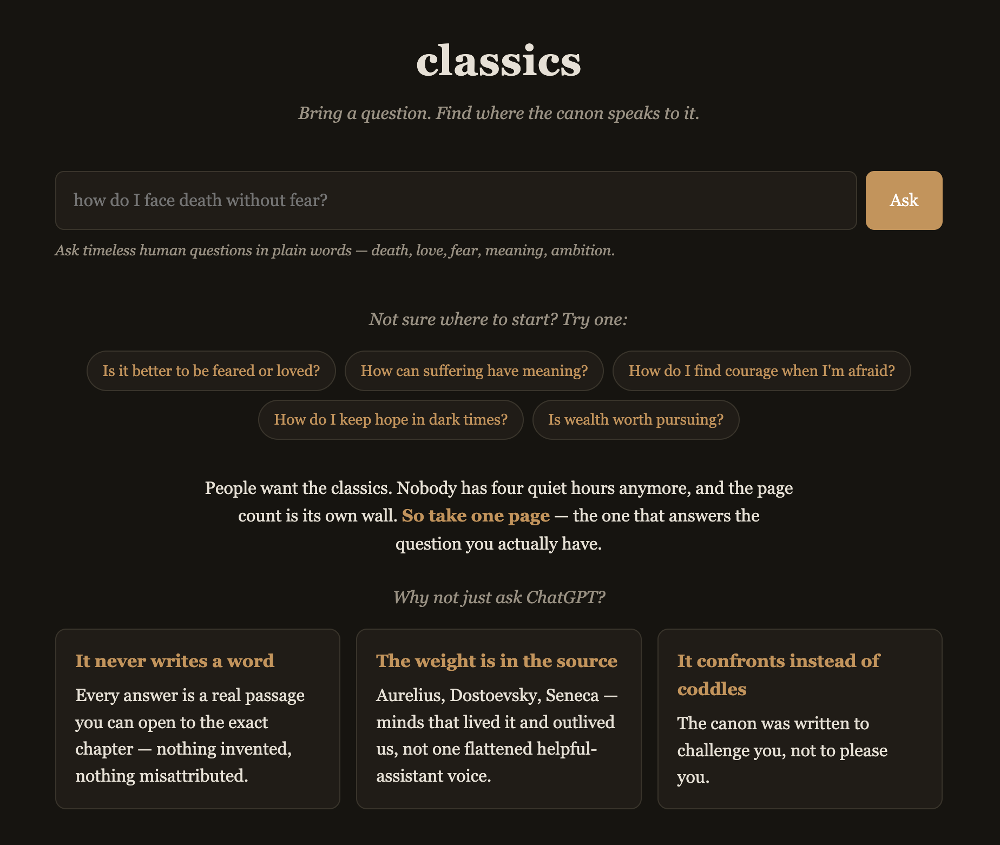
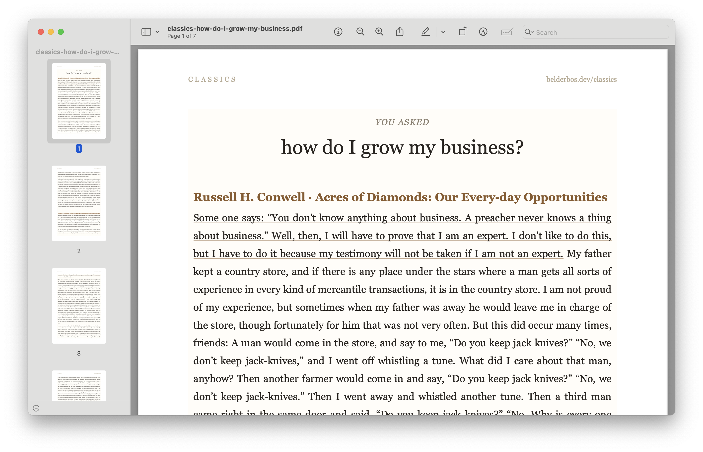

# classics

<p align="center">
  
</p>

Semantic search over a curated library of public-domain literature.

Instead of grepping for words, you bring a *question* — "how should I deal with people who
wrong me?" — and get the passages that mean that, ranked across every book in your library and
cited by author, title, and chapter. Matching is by meaning, not keywords, so a passage scores
high even when it shares no words with your query.

Everything runs locally. Books come from [Project Gutenberg](https://gutenberg.org) via the
[Gutendex](https://gutendex.com) API; passages are embedded once with
[`all-mpnet-base-v2`](https://huggingface.co/sentence-transformers/all-mpnet-base-v2) (no API key,
no network at query time) and matched with plain NumPy cosine similarity.

## How it works

1. **Index (once per book):** each book is split into ~600-word passages, tagged with their
   `Book`/`Chapter` heading, embedded, and cached to `books/<id>.{txt,chunks.json,npy,meta.json}`.
2. **Ask (per query):** only your question is embedded — one small vector — then matched against
   the cached library matrix. The corpus is never re-embedded.

The library is just `library.txt`: a list of Gutenberg IDs you grow over time.

## Architecture

The same core lives in `main.py` (chunk, embed, search) and is exposed two ways: the CLI above,
and a thin FastAPI shell in `web.py` that serves a browser UI. The library matrix is loaded once
and cached in memory; only the query is embedded per request. Searches and saved quotes are
recorded to a local SQLite database (`classics.db`) via SQLModel.

<p align="center">
  
</p>

## Setup

```bash
uv sync
```

## Usage

```bash
# find a book's Gutenberg id
uv run main.py search tolstoy war and peace

# download one book's text to books/
uv run main.py fetch 2600

# index books into the library (chunk + embed + cache)
uv run main.py index                 # index everything in library.txt (skips already-built)
uv run main.py index 1342 2680       # add these ids to library.txt and index them

# ask a question across the whole library
uv run main.py ask "how do I face death without fear"
uv run main.py ask "the meaning of suffering" -k 8        # return 8 passages
uv run main.py ask "ivan meets the devil" --book 28054    # limit to one book
```

`ask` prints the top passages with citations, then lets you pick one to read in full.

### Web UI

```bash
uv run fastapi dev web.py    # or: just server
```

Open the printed URL and ask a question in plain words. Each result is a real passage with
its citation. From there you can:

- **Copy** any passage to the clipboard.
- **Pick** several passages and **Download PDF** — a typeset A4 sheet of your question and the
  chosen excerpts, with the best-matching span underlined.
- **Share as image** — render a single passage as a shareable card.

<p align="center">
  
</p>

Searches and saved quotes are recorded to `classics.db` (SQLite).

The repo ships a `Justfile` wrapping the common commands — run `just` to list them (`just server`,
`just ask "..."`, `just index`, `just fetch <id>`, `just search ...`).

### Phrasing your question

This searches *what philosophers and novelists actually wrote*, so meet the corpus in its own
register. It shines on timeless human questions — death, love, fear, meaning, ambition — asked in
plain words. It struggles with modern jargon: a query like "how to be a better marketer?" scores
low not because the books are silent on it, but because the *word* is anachronistic — Montaigne
wrote about rhetoric and persuasion, Thoreau about honest trade, but never about "marketers". Ask
in the books' own terms ("how do I persuade people and win them to my view?") and the same ideas
surface with much higher scores.

You don't need to match the source text's words — the model handles paraphrase well. You need to
match the *theme*. Questions that land well:

- *how do I face death without fear?*
- *is it better to be feared or loved?*
- *is wealth worth pursuing?*
- *how do I forgive someone who wronged me?*
- *what makes a friendship last?*
- *how do I find courage when I am afraid?*

Modern jargon names a role or activity the canon never knew. Reframe it as the human concern
underneath, and the score roughly doubles:

| Instead of… (≈0.25) | Ask… (≈0.4+) |
| --- | --- |
| how do I market my business? | how do I persuade people and win them to my view? |
| advice for developers | how do I find meaning and pride in my work? |
| productivity and time management | is being busy the same as living well? |

Scores are relative: a top match around `0.45+` is strong. If even the best match falls below
`MIN_SCORE` (0.35) the question is treated as off-domain and nothing is shown — rather than five
weak matches dressed up as answers. Nonsense and modern-jargon queries top out around 0.28, so the
floor catches them while leaving real questions (which clear 0.40) untouched.

### Growing the library

Add a Gutenberg id (use `search` to find it) to `library.txt`, then run `uv run main.py index`.
The indexer skips anything already built, backfills missing metadata without re-embedding, and
reports any id it can't fetch — so re-running is always safe.

## Development

```bash
uv run ruff format .
uv run ruff check --fix .
uv run ty check .
uv run pytest -q
```
